# Deploying Frontend and Backend Applications on Amazon EKS with Docker and ECR
Deploying frontend and backend applications on Amazon Elastic Kubernetes Service (EKS) using Docker images stored in Amazon Elastic Container Registry (ECR).
## 1. Build Docker Images
Build Docker images for frontend and backend applications.Through Dockerfiles.
Build the frontend image
                        docker build -t frontend-app:v1.0 .
Build the backend image
                  docker build -t backend-app:v1.0 .
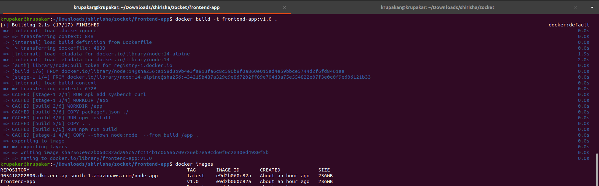   
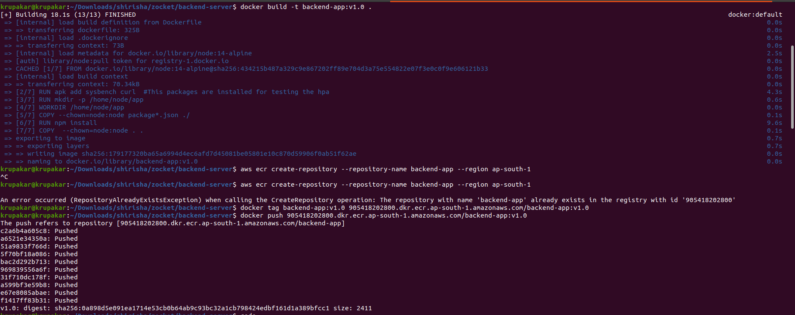
## 2. Set Up Amazon ECR
Create ECR Repositories:create a repositories through aws cli or through console.
Authenticate Docker to Your ECR:

Obtain an authentication token and log in to ECR registry:
                aws ecr get-login-password --region ap-south-1 | docker login --username AWS --password-stdin 905418202800.dkr.ecr.ap-south-1.amazonaws.com
frontend
            docker tag frontend-app:v1.0 905418202800.dkr.ecr.ap-south-1.amazonaws.com/frontend-app:v1.0
           docker push 905418202800.dkr.ecr.ap-south-1.amazonaws.com/frontend-app:v1.0

backend
             docker tag backend-app:v1.0 905418202800.dkr.ecr.ap-south-1.amazonaws.com/backend-app:v1.0
             docker push 905418202800.dkr.ecr.ap-south-1.amazonaws.com/backend-app:v1.0
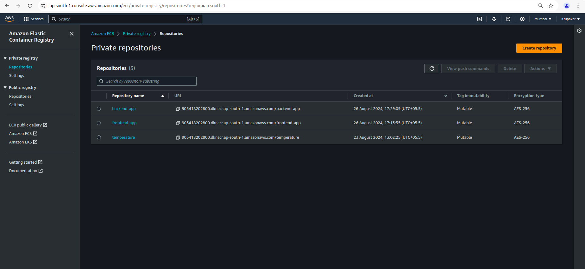
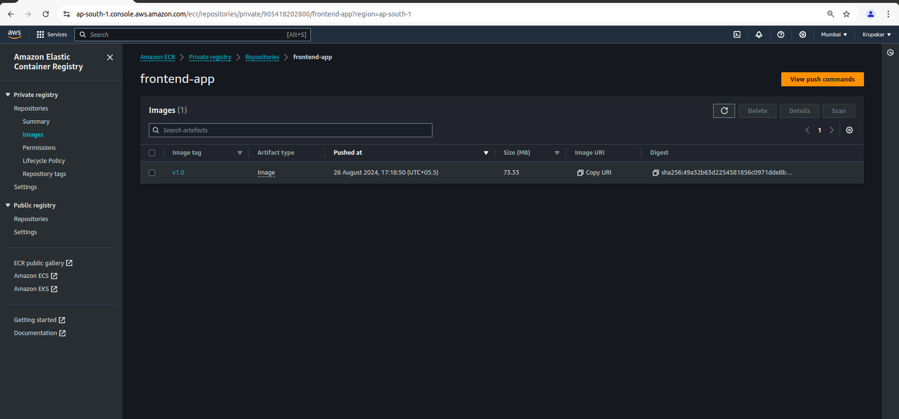
## 3. Configure Amazon EKS
1. Create EKS Cluster: Follow documentation or use the AWS Management Console to create an EKS cluster.    
2. Update kubeconfig: Ensure your kubectl is configured to interact with your EKS cluster.
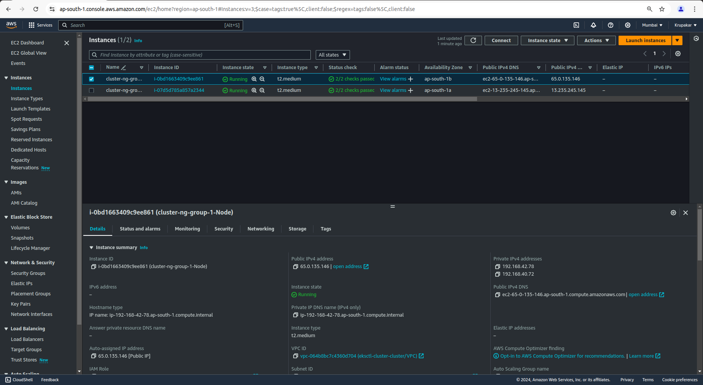
              aws eks update-kubeconfig --region ap-south-1 --name cluster
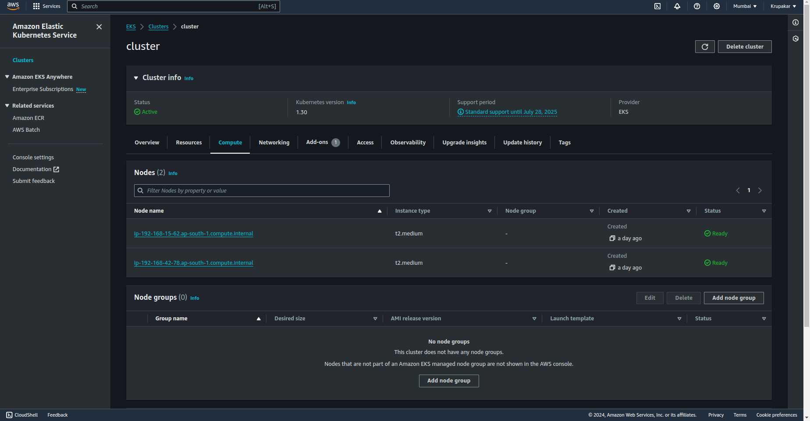
## 4. Create Kubernetes Manifests
Namespaces
create 2 different namespace for frontend and backend applications.   
## Frontend Deployment YAML
Create a deployment manifest for frontend application. Save this as frontend-deployment.yaml:
env: This field defines environment variables that are passed to the container at runtime. Environment variables are key-value pairs that can be accessed by the application running inside the container. They are used to configure the application without changing the container image.

name: This specifies the name of the environment variable. In this case, REACT_APP_BACKEND_URL is the name of the environment variable. This variable can be accessed by the frontend application to get the backend URL.

value: This specifies the value for the environment variable. Here, it is set to "http://a988dec2106ce46928bc338763519485-1592313788.ap-south-1.elb.amazonaws.com", which is likely the external URL of the backend service or load balancer.

SVC type: LoadBalancer: This setting creates an external load balancer in cloud provider (e.g., AWS) that routes external traffic to service. The load balancer gets an external IP or DNS name that can be used to access application from outside the Kubernetes cluster.

selector: The selector matches the labels on the pods. The service will route traffic to the pods with the label app: frontend-app.
ports: Defines the ports for the service:
port: 80: The port on which the service is exposed.
targetPort: 3000: The port on the container to which traffic is forwarded. This matches the containerPort specified in the deployment.

## Backend Deployment YAML
Create a deployment manifest for backend application. Save this as backend-deployment.yaml:
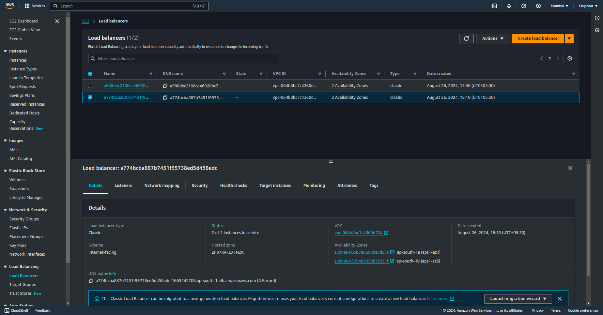

## 5. Apply Kubernetes Manifests
Deploy frontend and backend applications in EKS using kubectl:
Deploy frontend application
    kubectl apply -f frontend-deployment.yaml
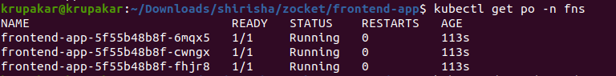

Deploy backend application
       kubectl apply -f backend-deployment.yaml
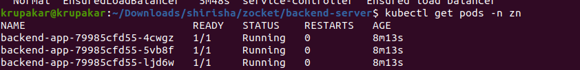
## 6. Access Applications
After deployment, frontend service will be exposed via a Load Balancer. Retrieve the external DNS name for the frontend service:
     kubectl get svc frontend-service -n zn
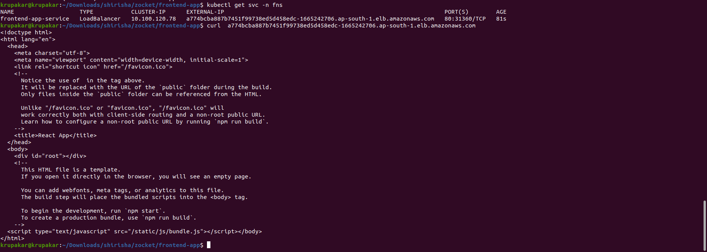
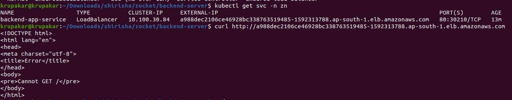
EXTERNAL-IP field in the output. This is the DNS name that you can use to access your frontend application.
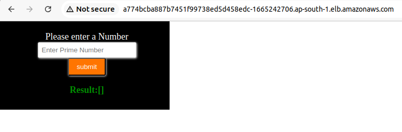
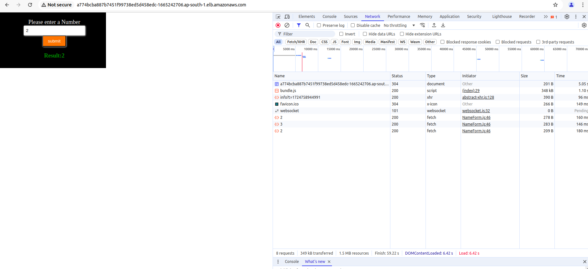
